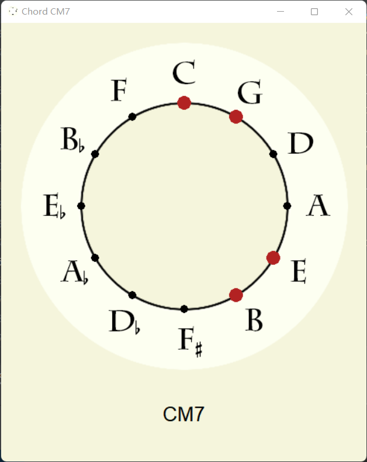
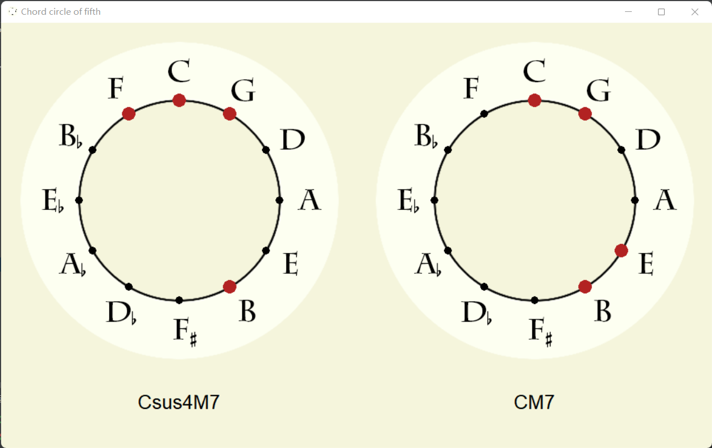

# Chord 用法示例：

```python
from pyPCS import Chord
C_1 = Chord([60, 64, 67])
C_2 = Chord([48, 55, 67])
Cadd9 = Chord([48, 55, 60, 62, 64, 67])
print(Chord.all_chords)  # 返回Chord的所有实例
```
## 实例方法
### 初始化的属性：
###### 以下以和弦 [60, 64, 67, 71] （即CM7）为例
* ##### length -> str ：音符数量
```
>>> 4
```
* ##### pitch_group -> list ：音高集合（MIDI协议作基准，60为C4）
```
>>> [60, 64, 67, 71]
```
* ##### pitch_class_group -> list ：音级集和
```
>>> [0, 4, 7, 11]
```
* ##### chroma_vector -> list ：色度向量
```
>>> [1, 0, 0, 0, 1, 0, 0, 1, 0, 0, 0, 1]
```
* ##### type -> str ：和弦种类
```
>>> CM7
```
* ##### cof_span -> int ：五度圈跨度值
```
>>> 5
```
* ##### semitone_num -> int ：音级集和的小二度数量
```
>>> 1
```
* ##### root_note -> int ：保罗-欣德米特 根音判别法
```
>>> 60
```
* ##### dissonance -> float ：自定义的不协和度算法，但其在理论层面尚不成熟。暂不显式地公开算法。不建议使用。
```
>>> 1.82
```
* ##### colour_hua -> float ：华萃康色度值，是一个角度值
```
>>> 30.0
```
* ##### consonance_tian -> float ：华萃康协和度值，范围为 1-10
```
>>> 7
```
* ##### colour_tian -> tuple ：田氏色度向量，由华氏协和度值和华氏色度值组合而成
```
>>> (7, 30.0)
```
###### 华氏协和度：参见华萃康《色彩和声》第352页“谱例7-4 和弦紧张度等级划分细则”
###### 部分参数详解参见其文章：<https://zhuanlan.zhihu.com/p/580555176>
### 实例的其他方法：

get_pc_group()：返回一个新的PitchClassSeries对象

show_circle_of_fifth(bg='Beige')：在Tkinter窗口中展示和弦的五度圆圈图，默认背景色是米色。



* play(player)：使用指定的pygame输出通道（pygame.midi.Output(int)）播放和弦。

* len(self)：返回和弦的音高列表长度。

* "-"：计算当前和弦和另一个和弦之间的音高平均值差值。

* ">"：比较当前和弦的音高平均值是否大于另一个和弦。

* "<"：比较当前和弦的音高平均值是否小于另一个和弦。

* 作为迭代器使用：返回和弦的音高列表。

## 静态方法
* get_colourTian_from_chromaVector(cv)：根据音高向量返回和弦的色度向量。
###### 以 [1, 0, 0, 0, 1, 0, 0, 1, 0, 0, 0, 1] 为例：
```
>>> (7, 30.0)
```

* get_colourTian_from_chordName(chord_name)：根据和弦名称返回和弦的调性和颜色。
###### 以 "CM7" 为例：
```
>>> (7, 30.0)
```

* show_circle_of_fifths(*chord_obj, bg='Beige')：在Tkinter窗口中展示一个及以上的和弦五度圆圈图。

